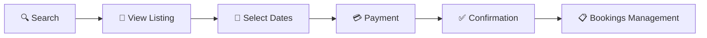

# 🏠 Booking Application

<div align="center">

A modern, full-stack property booking platform built with **Next.js 16**, **MongoDB**, and **Tailwind CSS**.

[](https://nextjs.org/)
[](https://www.typescriptlang.org/)
[](https://www.mongodb.com/)
[](https://tailwindcss.com/)

</div>

---

## 📋 Table of Contents

- [Overview](#-overview)
- [Tech Stack](#-tech-stack)
- [Features](#-features)
- [Getting Started](#-getting-started)
- [Project Structure](#-project-structure)
- [User Roles & Permissions](#-user-roles--permissions)
- [Payment System](#-payment-system)
- [Booking Flow](#-booking-flow)
- [Email Features](#-email-features)
- [Security](#-security)
- [API Reference](#-api-reference)
- [Deployment](#-deployment)

---

## 🌟 Overview

This comprehensive platform enables users to discover and book properties, manage wishlists, and become hosts to list their own properties. The platform includes **role-based access control** with dedicated dashboards for Guests, Hosts, and Admins.

---

## 🚀 Tech Stack

| Category           | Technologies                                                                       |
| ------------------ | ---------------------------------------------------------------------------------- |
| **Framework**      | [Next.js 16](https://nextjs.org/) (App Router)                                     |
| **Language**       | TypeScript                                                                         |
| **Database**       | MongoDB via [Mongoose](https://mongoosejs.com/)                                    |
| **Styling**        | [Tailwind CSS v4](https://tailwindcss.com/), [Radix UI](https://www.radix-ui.com/) |
| **Authentication** | Custom JWT Auth (jose, jsonwebtoken), Google OAuth 2.0                             |
| **Payments**       | Paymob (Unified Intention API)                                                     |
| **Maps**           | [Google Maps API](https://developers.google.com/maps) (@react-google-maps/api)     |
| **Media**          | Cloudinary (next-cloudinary)                                                       |
| **Email**          | Nodemailer                                                                         |
| **Validation**     | Zod                                                                                |
| **Date Utilities** | date-fns                                                                           |
| **UI Components**  | React 19, Lucide Icons, Sonner, React Day Picker, Embla Carousel                   |

---

## ✨ Features

### 👤 For Guests

| Feature                       | Description                                                     |
| ----------------------------- | --------------------------------------------------------------- |
| **Advanced Search & Filters** | Search listings by location, dates, guests, and property type   |
| **Interactive Booking**       | Select dates with a real-time availability calendar             |
| **Secure Payments**           | Integrated Paymob payment gateway with card support             |
| **Booking Management**        | View, track, and cancel bookings with payment status            |
| **Wishlists**                 | Save and organize favorite listings                             |
| **Profile Management**        | Complete profile with personal details, phone, and national ID  |
| **Interactive Q&A**           | Ask questions about listings and receive host answers           |
| **Reviews & Ratings**         | Leave detailed reviews for completed stays (24h after checkout) |
| **Email Verification**        | Secure verification system with resend functionality            |
| **Password Recovery**         | Forgot password and reset password functionality                |
| **Become a Host**             | Upgrade from Guest to Host role                                 |

### 🏡 For Hosts

| Feature                     | Description                                                                  |
| --------------------------- | ---------------------------------------------------------------------------- |
| **Listing Management**      | Create, edit, and delete property listings                                   |
| **Image Upload**            | Multi-image upload with Cloudinary integration                               |
| **Location Picker**         | Interactive Google Maps with autocomplete                                    |
| **Availability Management** | Block specific dates to mark as unavailable                                  |
| **Booking Dashboard**       | View and manage guest bookings                                               |
| **Host Statistics**         | Track active listings, pending bookings, upcoming guests, and total earnings |
| **Bank Details**            | Set up bank account for payment withdrawals                                  |
| **Q&A Management**          | View and answer questions from guests                                        |
| **Review System**           | View guest reviews and ratings                                               |
| **Approval System**         | Listings require admin approval before going live                            |

### 🔧 For Admins

| Feature                 | Description                                                 |
| ----------------------- | ----------------------------------------------------------- |
| **User Management**     | View, manage, block/unblock users                           |
| **Listing Approval**    | Approve or reject new listing submissions                   |
| **Booking Overview**    | Monitor all platform bookings                               |
| **Platform Statistics** | Dashboard with total users, listings, bookings, and revenue |
| **Role Management**     | Manage user roles (Guest, Host, Admin)                      |

### 🎯 Platform Features

- 🔐 **Role-Based Access Control** — Three user roles with distinct permissions
- 📱 **Responsive Design** — Optimized for mobile, tablet, and desktop
- 🌙 **Dark Mode** — Theme toggle with system preference support
- ⚡ **Real-time Availability** — Check listing availability before booking
- 🚫 **Double Booking Prevention** — Automatic validation to prevent conflicts
- 🔔 **Payment Webhooks** — Secure webhook handling for payment updates
- ✅ **Profile Completion** — Progressive completion for enhanced security
- 📧 **Email Notifications** — Automated emails for verification, bookings, etc.
- ⏰ **Review Reminders** — Scheduled notifications for post-stay reviews (Cron)

---

## 🛠️ Getting Started

### Prerequisites

- [Node.js](https://nodejs.org/) v18+
- MongoDB instance (local or [Atlas](https://www.mongodb.com/atlas))

### Installation

```bash
# Clone the repository
git clone https://github.com/abdallanoor/booking.git
cd booking

# Install dependencies
npm install
```

### Environment Variables

Create a `.env.local` file in the root directory:

```env
# Database
MONGODB_URI=your_mongodb_connection_string

# Authentication
JWT_SECRET=your_jwt_secret_key

# OAuth (Google)
NEXT_PUBLIC_GOOGLE_CLIENT_ID=your_google_client_id

# Cloudinary
CLOUDINARY_CLOUD_NAME=your_cloud_name
CLOUDINARY_API_KEY=your_api_key
CLOUDINARY_API_SECRET=your_api_secret

# Email (Nodemailer)
EMAIL_HOST=smtp.example.com
EMAIL_PORT=587
EMAIL_USER=your_email_user
EMAIL_PASS=your_email_password
EMAIL_FROM=noreply@yourdomain.com

# Payment Gateway (Paymob)
PAYMOB_SECRET_KEY=your_paymob_secret_key
PAYMOB_API_KEY=your_paymob_api_key
PAYMOB_PUBLIC_KEY=your_paymob_public_key
PAYMOB_HMAC_SECRET=your_paymob_hmac_secret
PAYMOB_INTEGRATION_ID=your_integration_id

# Google Maps
NEXT_PUBLIC_GOOGLE_MAPS_API_KEY=your_google_maps_api_key

# App
NEXT_PUBLIC_APP_URL=http://localhost:3000

# Cron Jobs
CRON_SECRET=your_cron_secret_key
```

### Run Development Server

```bash
npm run dev
```

Open [http://localhost:3000](http://localhost:3000) to view the application.

---

## 📂 Project Structure

```
src/
├── app/                          # Next.js App Router
│   ├── (admin)/admin/            # Admin dashboard, users, listings, bookings
│   ├── (auth)/                   # Authentication routes
│   │   ├── auth/                 # Login, register, forgot/reset password
│   │   └── verify-email/         # Email verification page
│   ├── (guest)/                  # Guest routes
│   │   ├── become-host/          # Host upgrade page
│   │   ├── bookings/             # View bookings, payment results
│   │   ├── listings/             # Browse and view listings
│   │   ├── profile/              # User profile management
│   │   ├── search/               # Search listings
│   │   └── wishlist/             # Saved listings
│   ├── (host)/hosting/           # Host dashboard
│   │   ├── bookings/             # Manage guest bookings
│   │   ├── listings/             # Manage listings, availability, questions
│   │   └── today/                # Today's activity
│   └── api/                      # API routes
│       ├── admin/                # Admin endpoints (stats, users)
│       ├── auth/                 # Authentication endpoints
│       ├── bookings/             # Booking management
│       ├── host/                 # Host-specific endpoints
│       ├── hosting/              # Hosting stats
│       ├── listings/             # Listing CRUD, blocked-dates, questions
│       ├── payments/             # Payment processing & webhooks
│       ├── reviews/              # Review management & notifications
│       ├── search/               # Search functionality
│       └── wishlist/             # Wishlist operations
│
├── components/                   # Reusable UI components
│   ├── auth/                     # Authentication forms
│   ├── booking/                  # Booking-related components
│   ├── hosting/                  # ListingForm, AvailabilityCalendar, RecentBookings
│   ├── layout/                   # Header, Nav, Footer
│   ├── listing/                  # Listing cards and grids
│   ├── maps/                     # GoogleMapsProvider, LocationPicker
│   ├── profile/                  # Profile forms, BankDetails
│   ├── Question/                 # Q&A components
│   ├── review/                   # Review & Rating components
│   ├── search/                   # Search bar and filters
│   └── ui/                       # Radix UI primitives
│
├── contexts/                     # React Context providers
│   ├── AuthContext.tsx           # Authentication state
│   └── SectionContext.tsx        # Section navigation
│
├── lib/                          # Utilities & configurations
│   ├── auth/                     # JWT utilities, middleware
│   ├── email/                    # Email templates (nodemailer.ts)
│   ├── paymob/                   # Payment gateway integration
│   └── validations/              # Zod validation schemas
│
├── models/                       # MongoDB/Mongoose models
│   ├── User.ts                   # User model with roles, bankDetails
│   ├── Listing.ts                # Property listing model
│   ├── Booking.ts                # Booking model
│   ├── Payment.ts                # Payment transaction model
│   ├── Wishlist.ts               # Wishlist model
│   ├── Review.ts                 # Review model
│   ├── Question.ts               # Question & Answer model
│   └── BlockedDate.ts            # Blocked dates for availability
│
├── services/                     # Business logic & database services
│   ├── auth.service.ts
│   ├── blocked-dates.service.ts
│   ├── bookings.service.ts
│   ├── listings.service.ts
│   ├── questions.service.ts
│   ├── reviews.service.ts
│   ├── search.service.ts
│   ├── stats.service.ts
│   ├── users.service.ts
│   └── wishlist.service.ts
│
├── actions/                      # Server actions
│
└── types/                        # TypeScript type definitions
```

---

## 🔐 User Roles & Permissions

### 👤 Guest (Default)

- Browse and search listings
- Make bookings and payments
- Manage personal profile (phone, country, national ID)
- Save listings to wishlist
- View booking history
- Ask questions about listings
- Leave reviews (24h after checkout)
- Upgrade to Host role

### 🏡 Host

- All Guest permissions, plus:
- Create and manage property listings
- Upload images via Cloudinary
- Set listing location via Google Maps
- Block dates for availability management
- View and manage booking requests
- Access hosting dashboard with statistics
- Set up bank details for withdrawals
- Answer guest questions

### 🔧 Admin

- Full platform access
- Manage all users (block/unblock)
- Approve or reject listings
- View all bookings and transactions
- Access platform-wide statistics
- Manage user roles

---

## 💳 Payment System

The application uses **Paymob** payment gateway:

| Feature                  | Description                         |
| ------------------------ | ----------------------------------- |
| **Secure Processing**    | PCI-compliant card payments         |
| **Payment Intentions**   | Pre-authorized payment flow         |
| **Webhook Integration**  | Real-time payment status updates    |
| **Payment States**       | Pending, Confirmed, Failed          |
| **Transaction Tracking** | Complete payment history            |
| **Currency**             | EGP (Egyptian Pound) by default     |
| **HMAC Verification**    | Secure webhook signature validation |

---

## 🔄 Booking Flow



1. **Search** — User searches for listings by location and dates
2. **Select** — User views listing details and checks availability
3. **Book** — User selects dates and number of guests
4. **Payment** — User is redirected to Paymob secure checkout
5. **Confirmation** — Upon successful payment, booking is confirmed
6. **Bookings Management** — User can view bookings, see details, and cancel for refund

---

## 📧 Email Features

| Email Type               | Trigger                        |
| ------------------------ | ------------------------------ |
| **Verification Email**   | User registration              |
| **Password Reset**       | Forgot password request        |
| **Booking Confirmation** | Successful payment             |
| **Payment Failed**       | Failed payment attempt         |
| **Review Invitation**    | 24 hours after checkout (Cron) |
| **Question Reply**       | Host answers a guest question  |

---

## 🛡️ Security

| Feature                  | Description                         |
| ------------------------ | ----------------------------------- |
| **JWT Authentication**   | Secure token-based authentication   |
| **Password Hashing**     | bcrypt encryption                   |
| **Email Verification**   | Required for account activation     |
| **Role-Based Access**    | Protected routes by user role       |
| **HMAC Verification**    | Webhook signature validation        |
| **Profile Completion**   | Required for booking/withdrawals    |
| **Input Validation**     | Zod schema validation on all inputs |
| **Injection Protection** | Mongoose sanitization               |
| **HTTP-Only Cookies**    | Secure auth token storage           |

---

## 🔌 API Reference

### Authentication

| Method | Endpoint                        | Description                     |
| ------ | ------------------------------- | ------------------------------- |
| `POST` | `/api/auth/register`            | User registration               |
| `POST` | `/api/auth/login`               | User login                      |
| `POST` | `/api/auth/logout`              | User logout                     |
| `GET`  | `/api/auth/me`                  | Get current user                |
| `POST` | `/api/auth/verify-email`        | Verify email address            |
| `POST` | `/api/auth/resend-verification` | Resend verification email       |
| `POST` | `/api/auth/forgot-password`     | Request password reset          |
| `POST` | `/api/auth/reset-password`      | Reset password with token       |
| `PUT`  | `/api/auth/update-password`     | Update password (authenticated) |
| `POST` | `/api/auth/google`              | Google OAuth authentication     |
| `POST` | `/api/auth/become-host`         | Upgrade to host role            |

### Listings

| Method   | Endpoint                                       | Description                         |
| -------- | ---------------------------------------------- | ----------------------------------- |
| `GET`    | `/api/listings`                                | Get all listings (with filters)     |
| `POST`   | `/api/listings`                                | Create listing (Host/Admin)         |
| `GET`    | `/api/listings/[id]`                           | Get listing by ID                   |
| `PUT`    | `/api/listings/[id]`                           | Update listing (Host/Admin)         |
| `PATCH`  | `/api/listings/[id]`                           | Partial update (Admin for status)   |
| `DELETE` | `/api/listings/[id]`                           | Delete listing (Host/Admin)         |
| `GET`    | `/api/listings/[id]/booked-dates`              | Get booked dates (includes blocked) |
| `GET`    | `/api/listings/[id]/blocked-dates`             | Get blocked dates (Host)            |
| `POST`   | `/api/listings/[id]/blocked-dates`             | Create blocked date range (Host)    |
| `DELETE` | `/api/listings/[id]/blocked-dates/[blockedId]` | Delete blocked date (Host)          |
| `GET`    | `/api/listings/[id]/questions`                 | Get questions for listing           |
| `POST`   | `/api/listings/[id]/questions`                 | Ask a question                      |

### Bookings

| Method  | Endpoint                           | Description             |
| ------- | ---------------------------------- | ----------------------- |
| `GET`   | `/api/bookings`                    | Get user bookings       |
| `POST`  | `/api/bookings`                    | Create booking          |
| `GET`   | `/api/bookings/[id]`               | Get booking details     |
| `PATCH` | `/api/bookings/[id]`               | Update booking (cancel) |
| `POST`  | `/api/bookings/check-availability` | Check availability      |

### Payments

| Method | Endpoint                 | Description            |
| ------ | ------------------------ | ---------------------- |
| `POST` | `/api/payments/initiate` | Initiate payment       |
| `GET`  | `/api/payments/[id]`     | Get payment details    |
| `POST` | `/api/payments/webhook`  | Paymob webhook handler |

### Reviews

| Method | Endpoint                          | Description                     |
| ------ | --------------------------------- | ------------------------------- |
| `GET`  | `/api/reviews`                    | Get reviews for a listing       |
| `POST` | `/api/reviews`                    | Create a review                 |
| `GET`  | `/api/reviews/[id]`               | Get review by ID                |
| `GET`  | `/api/reviews/check-eligibility`  | Check if user can review        |
| `POST` | `/api/reviews/send-notifications` | Trigger review reminders (Cron) |

### Search & Wishlist

| Method   | Endpoint                    | Description                  |
| -------- | --------------------------- | ---------------------------- |
| `GET`    | `/api/search`               | Search listings with filters |
| `GET`    | `/api/wishlist`             | Get user wishlist            |
| `POST`   | `/api/wishlist/[listingId]` | Add to wishlist              |
| `DELETE` | `/api/wishlist/[listingId]` | Remove from wishlist         |

### Host

| Method | Endpoint                   | Description         |
| ------ | -------------------------- | ------------------- |
| `GET`  | `/api/hosting/stats`       | Get host statistics |
| `GET`  | `/api/host/listings`       | Get host's listings |
| `POST` | `/api/host/questions/[id]` | Answer a question   |

### Admin

| Method  | Endpoint                | Description                 |
| ------- | ----------------------- | --------------------------- |
| `GET`   | `/api/admin/stats`      | Get platform statistics     |
| `GET`   | `/api/admin/users`      | Get all users               |
| `GET`   | `/api/admin/users/[id]` | Get user by ID              |
| `PATCH` | `/api/admin/users/[id]` | Update user (block/unblock) |

---

## 🚀 Deployment

### Prerequisites

1. MongoDB Atlas cluster or production MongoDB instance
2. Cloudinary account for image hosting
3. Paymob merchant account with API credentials
4. SMTP server for email delivery
5. Google OAuth 2.0 credentials
6. Google Maps API key

### Build & Deploy

```bash
# Build for production
npm run build

# Start production server
npm start
```

### Environment Variables

Ensure all environment variables are configured in your production environment. Refer to the [Environment Variables](#environment-variables) section above.

---

<div align="center">

**Built with ❤️ using Next.js**

</div>
